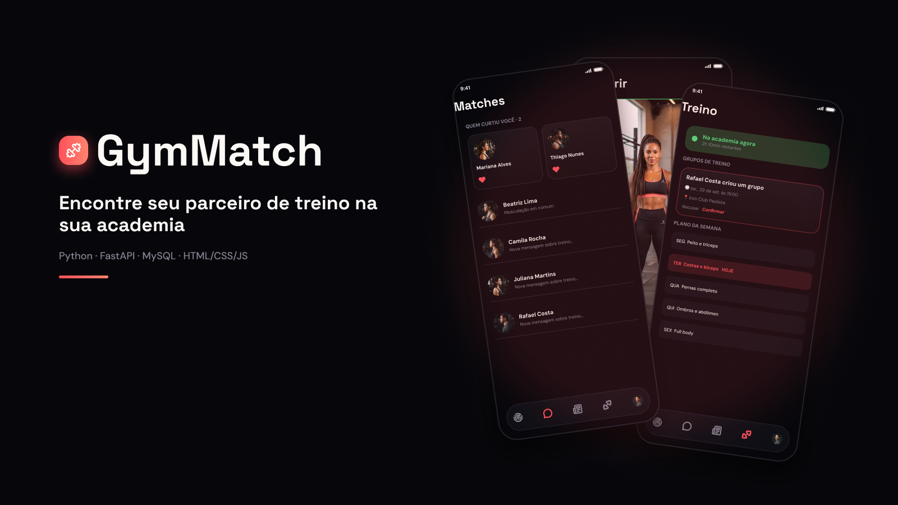
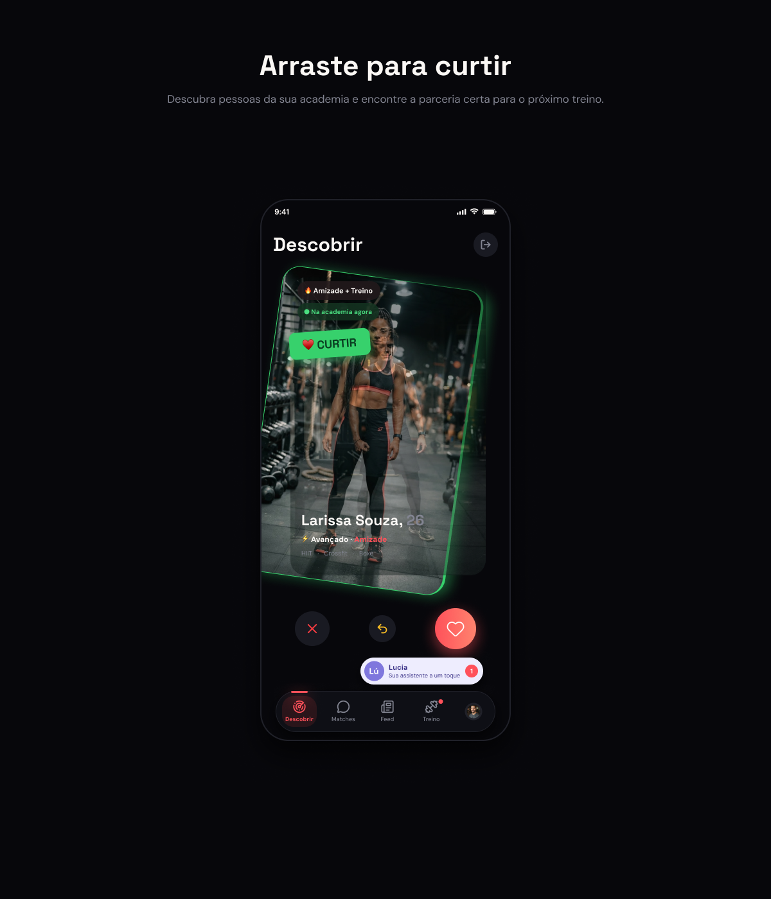
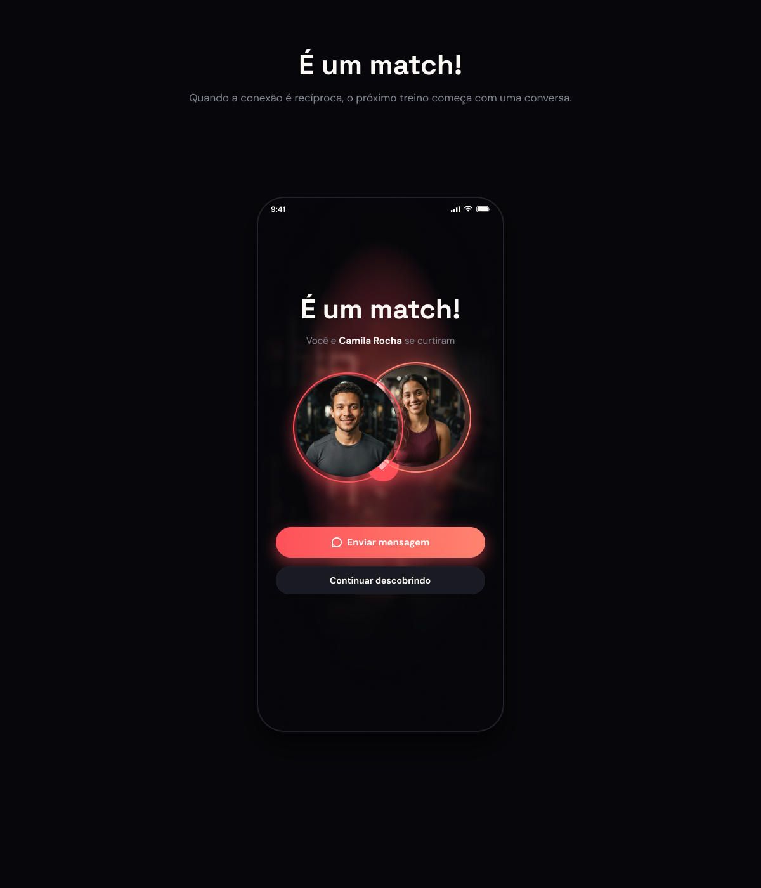
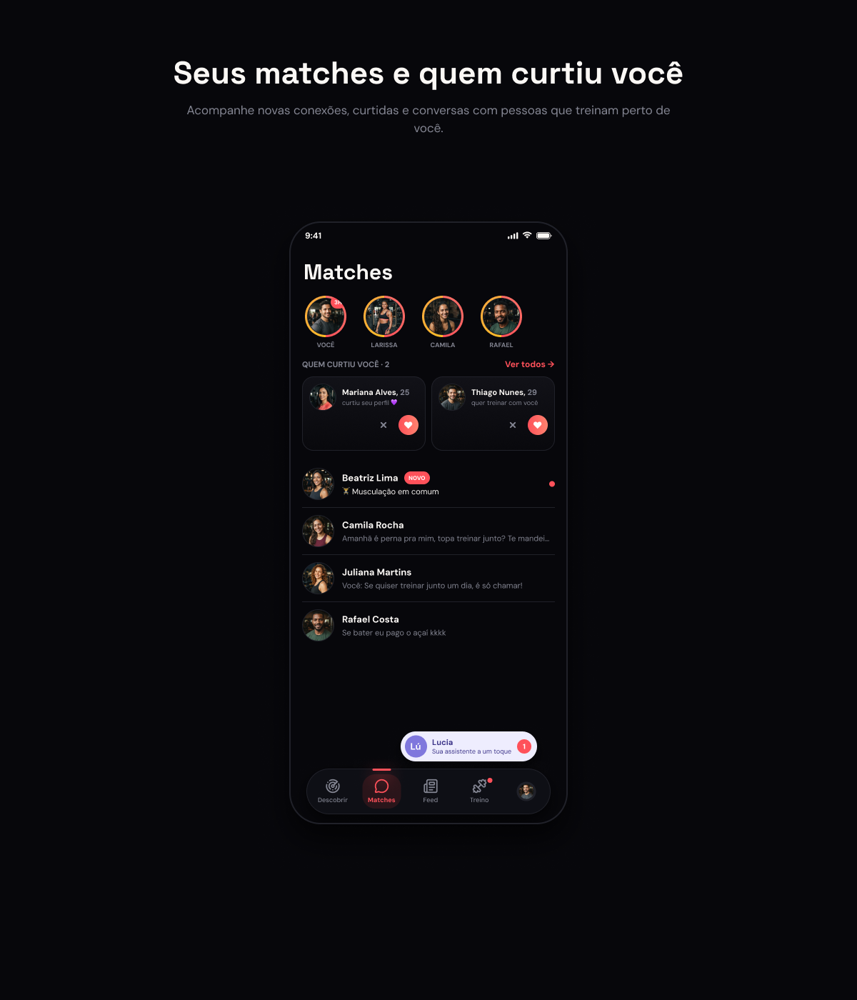
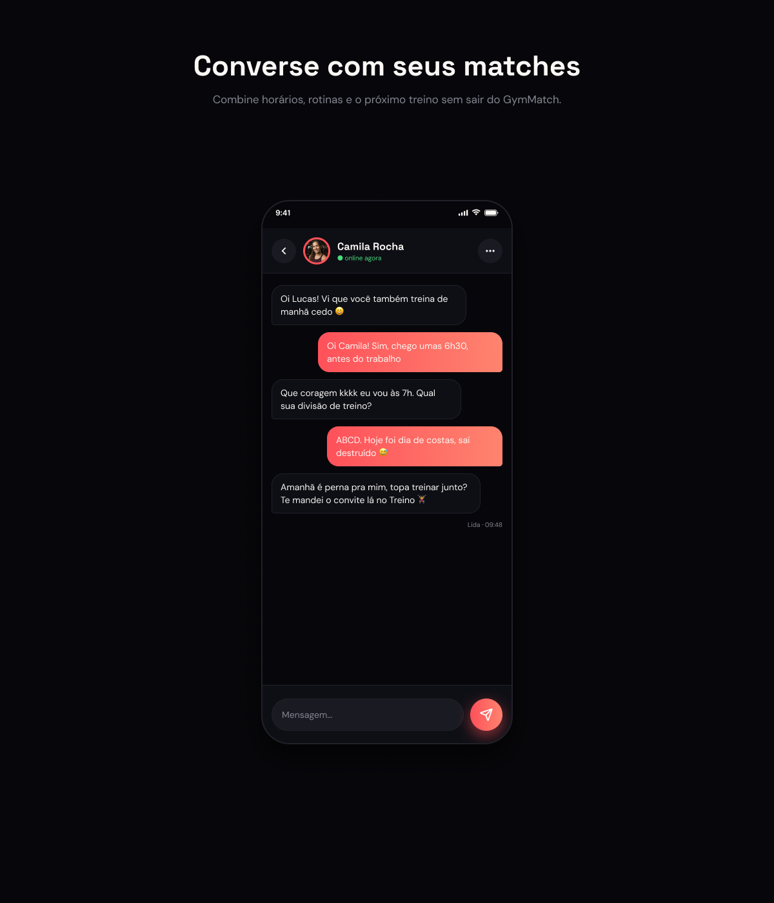
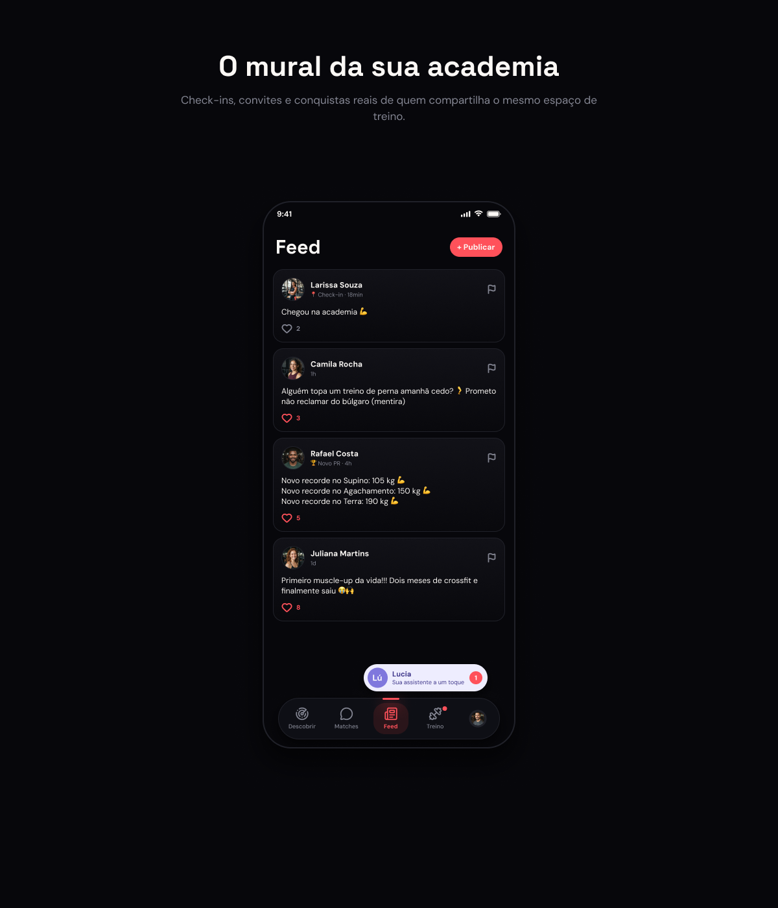
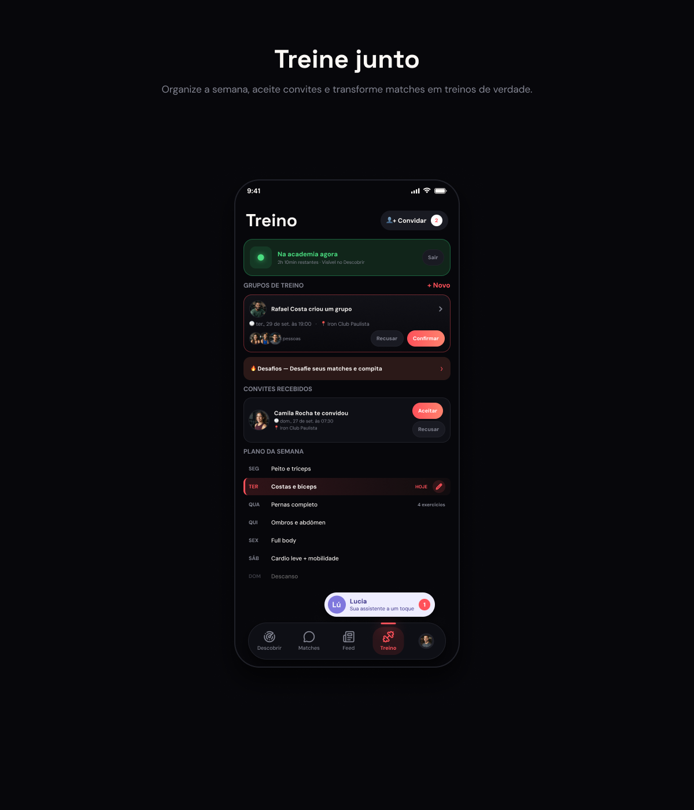
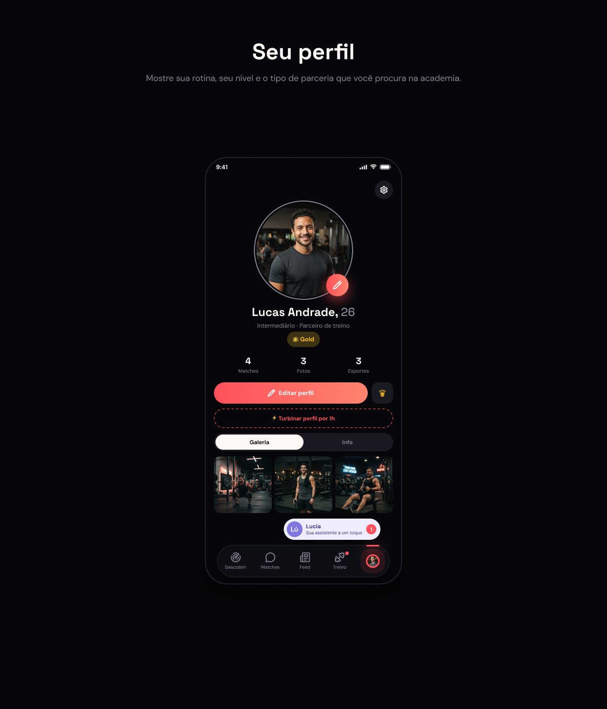
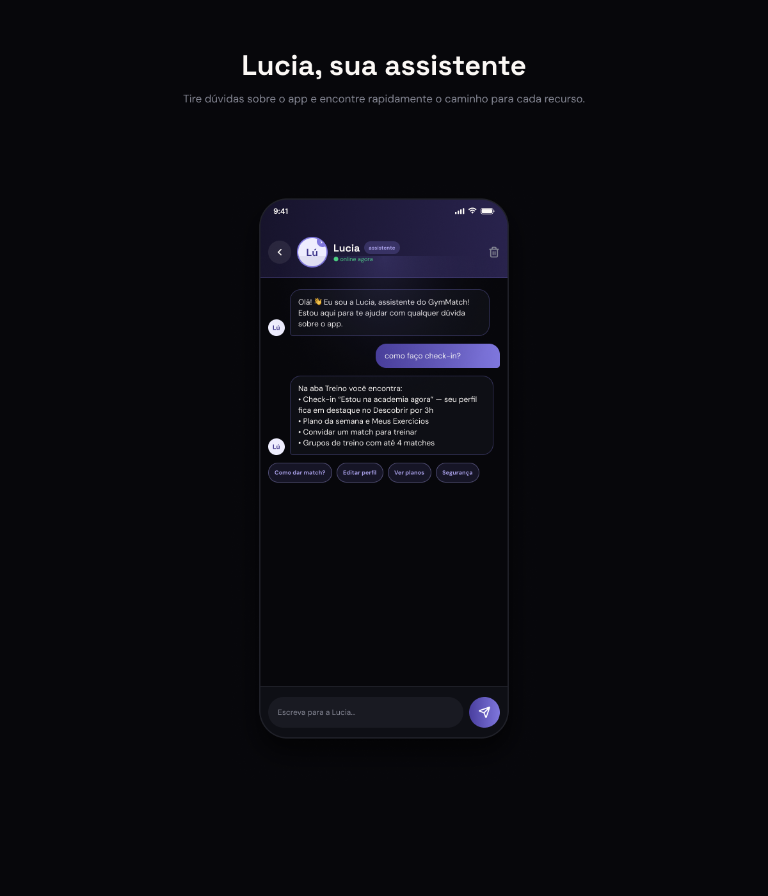

<p align="center">
  
</p>

# GymMatch

**Encontre seu parceiro de treino na sua academia.** O GymMatch conecta pessoas que treinam no mesmo lugar: dá para achar parceria de treino, amizade ou romance, conversar, marcar treinos juntos e acompanhar a comunidade da academia.

Trabalho acadêmico da disciplina de **Programação Orientada a Objetos**. O back-end foi escrito em **Python (FastAPI + MySQL)**, organizado em camadas e com os conceitos de POO aplicados no domínio. O front-end é **HTML, CSS e JavaScript puro**, sem framework.

---

## Telas

<table>
  <tr>
    <td width="50%"></td>
    <td width="50%"></td>
  </tr>
  <tr>
    <td><b>Descobrir</b> — perfis da sua academia. Arraste o card para a direita para curtir e para a esquerda para passar.</td>
    <td><b>É um match!</b> — quando a curtida é recíproca, o chat é liberado na hora, mesmo que tenha sido a outra pessoa a completar o match.</td>
  </tr>
  <tr>
    <td></td>
    <td></td>
  </tr>
  <tr>
    <td><b>Matches</b> — Moves (stories de 24h), quem curtiu você e suas conversas.</td>
    <td><b>Chat</b> — conversa em tempo quase real, com opção de bloquear e denunciar.</td>
  </tr>
  <tr>
    <td></td>
    <td></td>
  </tr>
  <tr>
    <td><b>Feed</b> — o mural da academia: posts, check-ins e recordes (PRs) publicados automaticamente.</td>
    <td><b>Treino</b> — check-in "na academia agora", plano da semana, exercícios, convites e grupos de treino.</td>
  </tr>
  <tr>
    <td></td>
    <td></td>
  </tr>
  <tr>
    <td><b>Perfil</b> — fotos, recordes, plano (Grátis, Gold ou Diamond) e boost de 1h no topo do Descobrir.</td>
    <td><b>Lucia</b> — assistente virtual com IA que tira dúvidas sobre o app, com filtros de segurança no servidor.</td>
  </tr>
</table>

---

## Funcionalidades

- **Cadastro e onboarding** em etapas, com escolha de academia, objetivo, nível, modalidades e horários.
- **Descobrir**: gesto de arrastar com física (a velocidade conta, o card gira a partir de onde foi pego), filtro por faixa etária, desfazer curtida e prioridade para quem tem boost ou fez check-in.
- **Matches e chat** só de texto, com bloqueio e denúncia.
- **Moves**: stories de 24h, com editor de foto (zoom, filtros, textos e tags).
- **Feed da academia** com curtidas, denúncia, paginação infinita e aviso de novas publicações.
- **Treino**:
  - check-in de 3h que destaca o perfil no Descobrir;
  - plano da semana e exercícios por dia;
  - convites 1 a 1 e grupos de até 4 pessoas.
- **Planos** Grátis, Gold e Diamond, com limites diferentes e pagamento **simulado**.
- **Lucia**, assistente virtual:
  - responde com IA (Groq) quando há chave configurada;
  - sem chave, responde por regras locais;
  - os filtros de segurança e o limite de mensagens rodam no servidor.
- **Notificações do navegador** para match, mensagem e convite de treino quando a aba está em segundo plano.
- **Configurações**: ocultar objetivo, pausar conta, alterar senha, excluir conta, Termos e Privacidade.
- **Transições animadas entre telas** (View Transitions): a barra inferior fica parada e o conteúdo desliza.

---

## Conceitos de POO aplicados

| Conceito | Onde aparece no código |
|---|---|
| **Encapsulamento** | Atributos privados com `@property`/setters que validam os dados. Exemplos: `Perfil`, `Exercicio` (séries de 1 a 20) e `MensagemLucia` (até 500 caracteres). |
| **Herança** | `PlanoDiamond` herda de `PlanoGold`, que herda de `Plano`. `AdminUsuario` herda de `Usuario`. |
| **Classes abstratas** | `Plano`, `Post` e `MotorLucia` (`abc.ABC`) definem o contrato que as subclasses cumprem. |
| **Polimorfismo** | Cada plano responde `limite_curtidas_diarias()` do seu jeito, sem `if plano == "gold"`. `AdminUsuario.pode_excluir_post()` sobrescreve a regra do usuário comum. `PostManual`, `PostRecorde` e `PostCheckin` trazem rótulos próprios. |
| **Composição** | `PlanoSemanal` é formado por 7 `DiaTreino`, e cada `DiaTreino` guarda seus `Exercicio`. `SessaoGrupo` guarda seus `MembroSessao`. |
| **Máquina de estados** | `ConviteTreino` só muda de status por `aceitar()`, `recusar()` e `cancelar()`, que validam quem pode agir e a partir de qual estado. |
| **Estratégia / injeção de dependência** | O `LuciaService` recebe uma lista de motores (`MotorGroq`, `MotorRegras`) e usa o próximo se um falhar. Os services recebem os repositories no construtor. |
| **Separação em camadas** | `models` (domínio) → `repositories` (só SQL) → `services` (regras de negócio) → `routers` (só HTTP). |

---

## Tecnologias

- **Back-end:** Python 3.11+, FastAPI, Pydantic, MySQL 8 (`mysql-connector-python`), JWT (`python-jose`), `passlib`/bcrypt e `httpx` (IA da Lucia).
- **Front-end:** HTML, CSS (cores em OKLCH) e JavaScript puro, sem build e sem framework.

```
backend/
  app/
    models/        classes de domínio
    repositories/  acesso ao MySQL (uma classe por entidade)
    services/      regras de negócio
    schemas/       validação de entrada e saída (Pydantic)
    routers/       endpoints HTTP
  schema.sql       criação do banco
frontend/
  *.html           uma página por tela
  css/  js/        estilos e scripts de cada tela
docs/imagens/      imagens deste README
```

---

## Como rodar

### Pré-requisitos
- Python 3.11 ou mais novo
- MySQL 8 rodando localmente

### 1. Banco de dados

```bash
mysql -u root -p < backend/schema.sql
```

Cria o banco `gymmatch` com todas as tabelas e duas academias de exemplo.

### 2. Back-end

```bash
cd backend
python -m venv venv
venv\Scripts\activate          # Windows  (Linux/Mac: source venv/bin/activate)
pip install -r requirements.txt
copy .env.example .env         # Linux/Mac: cp .env.example .env
```

No `.env`, preencha o usuário e a senha do seu MySQL (`DB_USER`, `DB_PASSWORD`).

A **Lucia** funciona sem configurar nada: sem chave, ela responde por regras locais. Para respostas com IA, crie uma chave gratuita em [console.groq.com](https://console.groq.com) e preencha `GROQ_API_KEY` no `.env`. A chave fica só no servidor.

```bash
uvicorn app.main:app --reload
```

A API sobe em `http://localhost:8000`, com a documentação interativa (Swagger) em `http://localhost:8000/docs`.

### 3. Front-end

Em outro terminal:

```bash
cd frontend
python serve_no_cache.py 5500
```

Acesse **http://localhost:5500**.

> Use o `serve_no_cache.py`, e não o `python -m http.server`. Ele sempre entrega a versão mais nova dos arquivos, atende vários pedidos ao mesmo tempo e responde também pelo IPv6. No Windows, sem isso, cada arquivo demora ~200 ms a mais para carregar.

> As animações de transição entre telas funcionam no **Chrome e no Edge**. Em outros navegadores, as telas só trocam sem animação.

### Testando
1. Crie duas contas e escolha a **mesma academia** nas duas.
2. Com a conta A, vá em **Descobrir** e curta a conta B. Com a conta B, curta a conta A: aparece **"É um match!"**.
3. Abra o chat em **Matches**, publique no **Feed**, faça um check-in e mande um convite em **Treino**.
4. Converse com a **Lucia** pelo botão "Lú" ou em Perfil → Configurações.

---

<p align="center"><sub>Projeto acadêmico · sem fins comerciais · pagamentos simulados · pessoas e conversas das imagens são fictícias</sub></p>
